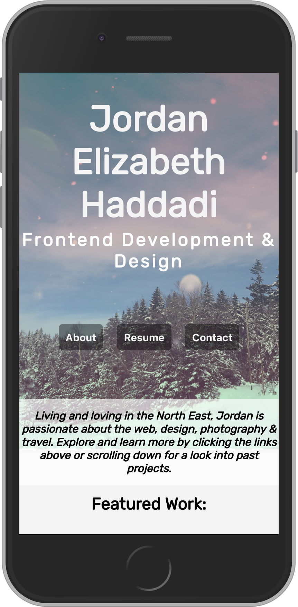
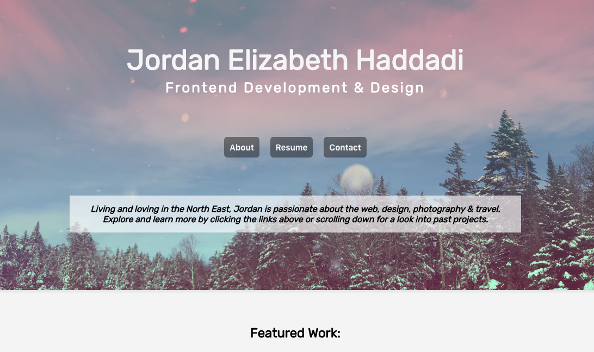
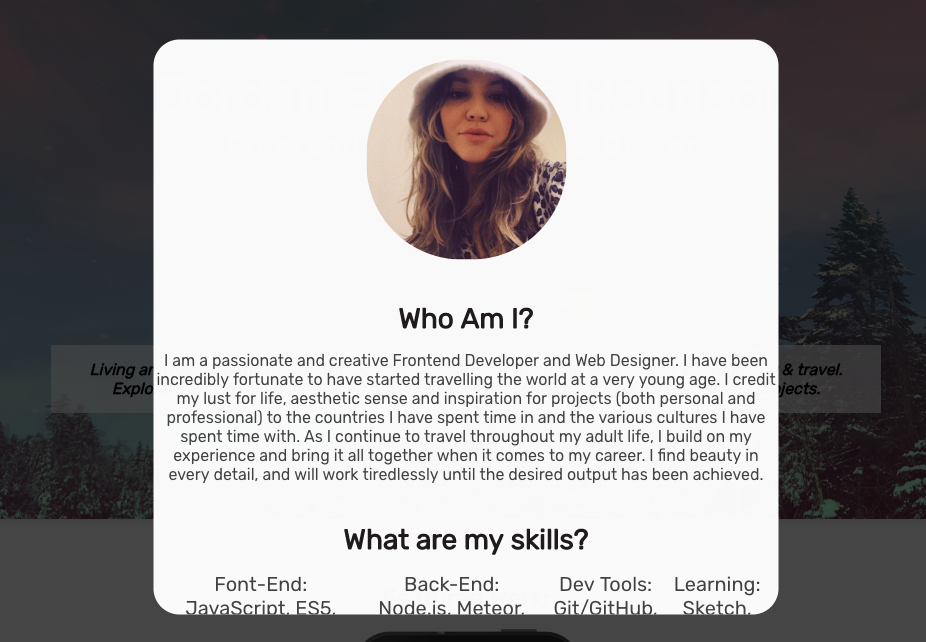
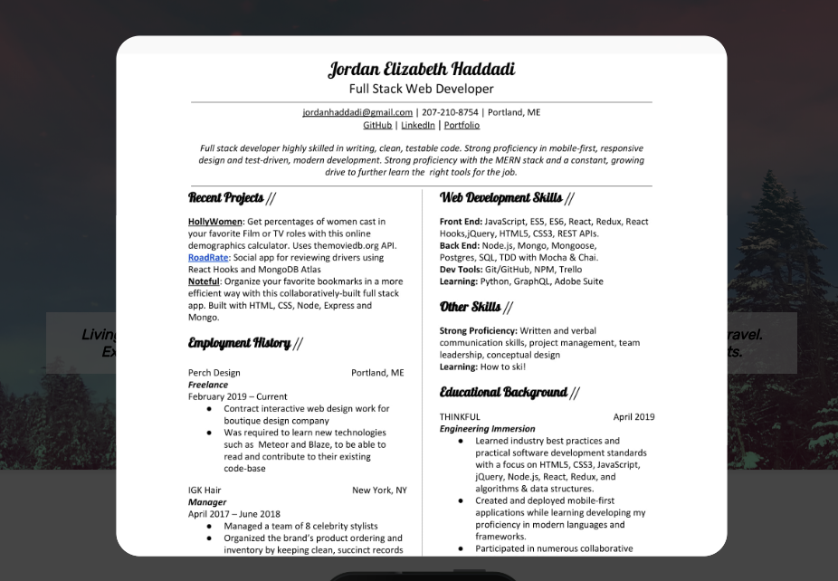
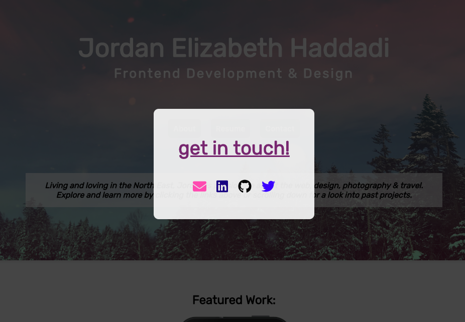

This project was bootstrapped with [Create React App](https://github.com/facebook/create-react-app).

# Jordan Elizabeth Haddadi 

Living and loving in the North East, Jordan is passionate about the web, design, photography & travel. 

## About My Portfolio:

My portfolio was created from scratch, without template or helpers, to showcase my skill as a developer & designer. You can learn more about my skill sets and passions through the 'about me' link, view my resume, contact me through popular social platforms and/or email, and peruse  some of my projects that are currently being featured. 

## Live Version Link:
http://www.jordanhaddadi.com/

## Tech Stack:
**Front End:** 
  - [Create React App](https://github.com/facebook/create-react-app)
  - [React](https://github.com/facebook/react)
  - [React Hooks](https://reactjs.org/docs/hooks-intro.html)
  - [CSS](https://developer.mozilla.org/en-US/docs/Web/CSS)

## Screenshots:

